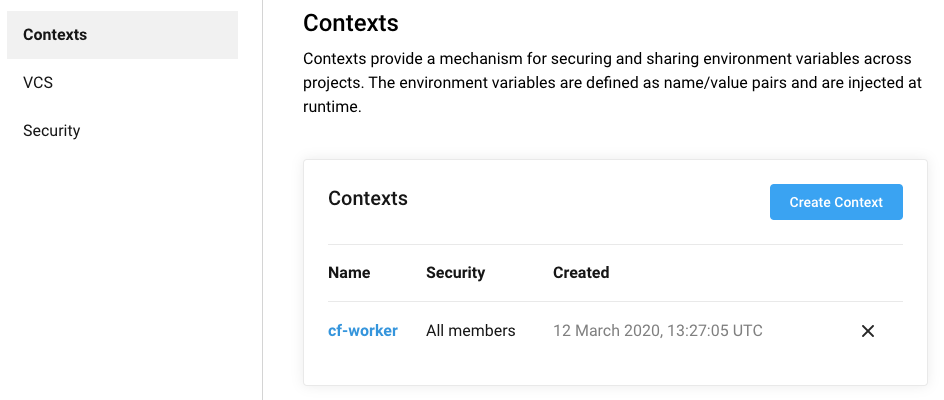
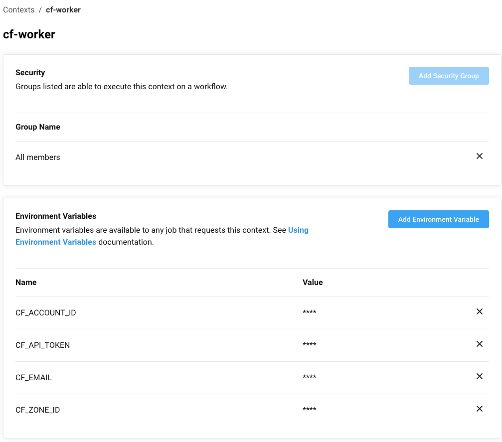
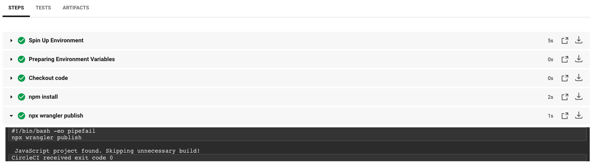

# CircleCI

## Create your CircleCI `config.yml`
CircleCI uses the directory `.circleci` located in the root of your repository. Create the file `config.yml` under the directory `.circleci/`.

Tag the version of CircleCI:
````yaml
version: 2.1
````

Describe a job named `deploy`. This job will use the pre-built Circle CI image `circleci/node:lts`:
```yaml
jobs:
  deploy:
    docker:
      - image: circleci/node:lts
    steps:
      - checkout
      - run: npm install
      - run: npx wrangler publish
```

Where:
* `image: circleci/node:lts` will use the latest stable version of Node.js as a build environment
* `steps` will checkout the code, install the dependencies and deploy the Cloudflare Worker using `wrangler` which is a binary installed with the `@cloudflare/wrangler` npm dependency

`wrangler publish` requires 4 environment variables to deploy a Cloudflare Worker, all of which can be created as environment variables in a context inside your CircleCI organization settings. More on that later.

Copy the following to indicate CircleCI which job to run:
```yaml
workflows:
  deploy:
    jobs:
      - deploy: # name of the job setup earlier
          context: cf-worker # name of the context setup earlier
```

[A complete example of a `.circleci/config.yml` file can be found here.](../.circleci/config.yml)

## Create a CircleCI context
As mentioned in the previous step, `wrangler publish` requires 4 environment variables which it will use to deploy the Cloudflare Worker. You can use a context in CircleCI to store secrets as environment variables. To setup a context, go to your organization settings in CircleCI, in the Contexts panel click on `Create Context` and name it `cf-worker`.




Add the following environment variables:
* `CF_EMAIL`: your Cloudflare email
* `CF_ACCOUNT_ID`: your Cloudflare account ID
* `CF_ZONE_ID`: your Cloudflare Zone ID
* `CF_API_KEY`: your Cloudflare Global API Key

For more infornation on CircleCI contexts, see https://circleci.com/docs/2.0/contexts/#creating-and-using-a-context.

## Commit and push to GitHub
From here, you can test your CircleCI integration by adding and pushing your code to GitHub. CircleCI will automatically pick up your commit and deploy your Cloudflare Worker:
```bash
git add .
git push origin master
```

Check your results in CircleCI:

