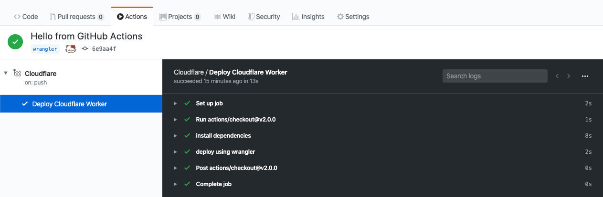

# GitHub Actions
## Create your GitHub Actions workflow `.github/workflows/cloudflare.yml`

Declare the name and trigger of your workflow:
```yaml
name: Cloudflare
on: [push]
```

Where
* `name: Cloudflare` is the name of your action
* `on: [push]` instructs GitHub Actions to trigger the action on each push on your repository

Add a job named `build`:
```yaml
jobs:
  build:
    runs-on: ubuntu-latest
    name: Deploy Cloudflare Worker
    steps:
      - uses: actions/checkout@v2.0.0
      - name: install dependencies
        run: 'npm install'
      - name: deploy using wrangler
        run: 'npx wrangler publish'
        env:
          CF_EMAIL: ${{secrets.CF_EMAIL}}
          CF_ACCOUNT_ID: ${{secrets.CF_ACCOUNT_ID}}
          CF_ZONE_ID: ${{secrets.CF_ZONE_ID}}
          CF_API_KEY: ${{secrets.CF_API_KEY}}
```

Where
* `runs-on: ubuntu-latest` indicates the build environment will be ubuntu
* `name: Deploy Cloudflare Worker` is the display name of your job
* `steps` this job will checkout the code, install its dependencies with `npm install` and deploy the Cloudflare Worker using `npx wrangler publish`. You can see 4 environments variables: `CF_EMAIL`, `CF_ACCOUNT_ID`, `CF_ZONE_ID` and `CF_API_KEY`. Those will be set at a later step.

[A complete example of a `.github/workflows/cloudflare.yml` file can be found here.](../.github/workflows/cloudflare.yml)

## Create GitHub secrets
Wrangler requires 4 environment variables to deploy a Cloudflare Worker, all of which can be created as GitHub secrets and configured as environment variables inside `.github/workflows/cloudflare.yml`, as we have seen in the previous step.

You must have sufficient access privileges on your GitHub repository to create secrets. You can define a secret from your repository Settings, under the Secrets section.


Add the following secrets:
* `CF_EMAIL`: your Cloudflare email
* `CF_ACCOUNT_ID`: your Cloudflare account ID
* `CF_ZONE_ID`: your Cloudflare Zone ID
* `CF_API_KEY`: your Cloudflare Global API Key

Back to `.github/workflows/cloudflare.yml`, we remember setting those 4 environments variables:
```yaml
env:
  CF_EMAIL: ${{secrets.CF_EMAIL}}
  CF_ACCOUNT_ID: ${{secrets.CF_ACCOUNT_ID}}
  CF_ZONE_ID: ${{secrets.CF_ZONE_ID}}
  CF_API_KEY: ${{secrets.CF_API_KEY}}
```

Where `${{secrets....}}` indicates GitHub Actions to fetch the value from the secrets.

## Commit and push to GitHub
From here, you can test your GitHub Actions integration by adding and pushing your code to GitHub. GitHub Actions will automatically pick up your commit and deploy your Cloudflare Worker:
```bash
git add .
git push origin master
```

Check your results in GitHub Actions:

