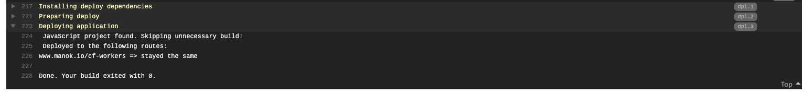

# Travis CI
## Create your Travis CI file `.travisci.yml`
Specify the language you wish Travis CI to run your job:
```yaml
language: node_js
node_js:
  - "node"
```

Where
* `language: node_js` will use a javascript build environment with Node.js installed
* `"node"` will use the latest stable version of Node.js

Describe the deploy action:
```yaml
deploy:
  - provider: script
    script: npx wrangler publish
    skip_cleanup: true
    on:
      all_branches: true
```

Where
* `provider:script` instructs travis to use a script to deploy
* `script: npx wrangler publish` uses the `wrangler` binary installed with the `@cloudflare/wrangler` npm dependency
* `script_cleanup: true` ensures travis will keep all artifacts in the current workspace, which we need to deploy
* `all_branches: true` allow deploy action to execute on all commits in every branches. In a production scenario you would specify a specific branch

[A complete example of a `.travisciyml` file can be found here.](../.travis.yml)

## Create environment variables
Serverless requires 4 environment variables to deploy a Cloudflare Worker, all of which can be created as environment variables in Travis CI.


Add the following environment variables:
* `CF_EMAIL`: your Cloudflare email
* `CF_ACCOUNT_ID`: your Cloudflare account ID
* `CF_ZONE_ID`: your Cloudflare Zone ID
* `CF_API_KEY`: your Cloudflare Global API Key

Ensure `CF_API_KEY` does not display its value in the log.

## Commit and push to GitHub
From here, you can test your Travis CI integration by adding and pushing your code to GitHub. Travis CI will automatically pick up your commit and deploy your Cloudflare Worker:
```bash
git add .
git push origin master
```

Check your results in Travis CI:


